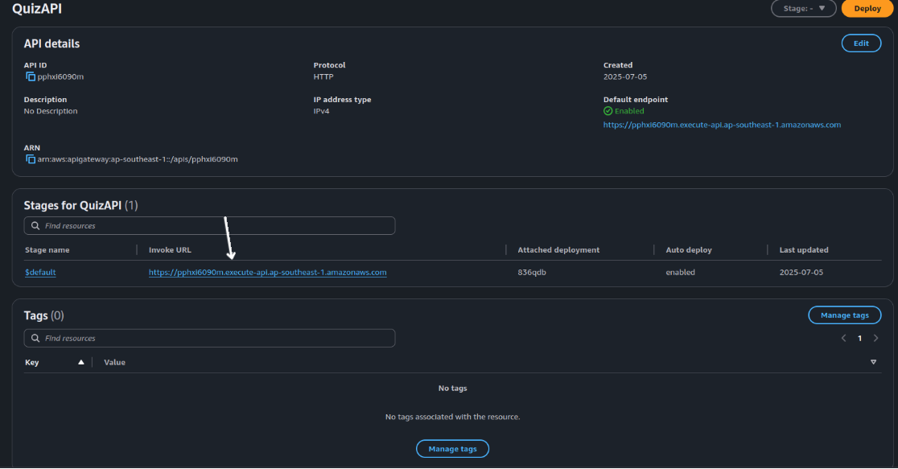

**Content:**
- [Create S3 bucket](#create-s3-bucket)
- [Prepare sample quiz JSON](#prepare-sample-quiz-json)
- [Create Lambda functions](#create-lambda-functions)
- [Create IAM role and policy](#create-iam-role-and-policy)
- [Attach IAM permissions](#attach-iam-permissions)
- [Add Lambda code](#add-lambda-code)
- [Configure API Gateway](#configure-api-gateway)
- [Attach IAM permissions](#attach-iam-permissions)
- [Test CRUD operations](#test-crud-operations)
- [Outcome](#outcome)

---

#### Create S3 bucket

1. Go to the **S3 Console**.
2. Click **Create bucket**.
3. Name it.
4. Choose a region, for example: (ap-southeast-1).
5. Leave the rest of the settings as default.
6. Click **Create bucket** to finish setup.


---

#### Prepare sample quiz JSON

1. On your local machine, create a file named (quiz.json) with the following content, and upload that file to newly created bucket.


```json

{ 
  "id": "quiz-001",
  "title": "AWS Basics Quiz",
  "questions": [
    {
      "id": "q1",
      "text": "Which AWS services are serverless?",
      "type": "multiple", 
      "options": ["EC2", "S3", "Lambda", "Fargate"],
      "answer": [1, 2, 3]
    },
    {
      "id": "q2",
      "text": "What is the max size of an S3 object?",
      "type": "single",
      "options": ["5 GB", "50 GB", "5 TB", "50 TB"],
      "answer": [2]
    }
  ]
}

```

---
---
#### Create IAM role and policy

1. Go to the **IAM Console**.
2. Select **Policies** → **Create Policy**.
3. We will create 3 separate policies:

4. Choose the **JSON** tab and paste the following:


-   For **s3ReadOnlyAccess**:
```json
{
    "Version": "2012-10-17",
    "Statement": [
        {
            "Sid": "VisualEditor0",
            "Effect": "Allow",
            "Action": "s3:GetObject",
            "Resource": "arn:aws:s3:::myprojectbucket1290/*"
        }
    ]
}
```

-   For **s3PutOnlyAccess**:
```json
{
    "Version": "2012-10-17",
    "Statement": [
        {
            "Sid": "VisualEditor0",
            "Effect": "Allow",
            "Action": "s3:PutObject",
            "Resource": "arn:aws:s3:::myprojectbucket1290/*"
        }
    ]
}
```

-   For **s3RemoveOnlyAccess**:
```json
{
    "Version": "2012-10-17",
    "Statement": [
        {
            "Sid": "VisualEditor0",
            "Effect": "Allow",
            "Action": "s3:DeleteObject",
            "Resource": "arn:aws:s3:::myprojectbucket1290/*"
        }
    ]
}
```

4. Name the policy and create it.

5. Now go to **Roles** → **Create Role**. Each policy will have their own role


6. Select **Lambda** as the trusted entity type.


7. Attach the policy you just created.


8. Name the role and create it.


8. Repeat the steps for **s3PutOnlyAccess** and **s3RemoveOnlyAccess**
9. Final result:


---

#### Create Lambda functions

Create 4 Lambda functions using Node.js 20.x or 22.x. Use the following names and HTTP methods:


---

#### Add Lambda code

**Example: myGetFunction**

```js

import { S3Client, GetObjectCommand } from "@aws-sdk/client-s3";
import { Readable } from "stream";

const s3 = new S3Client({});
const BUCKET = "myprojectbucket1290"; //Change bucket name here

const streamToString = (stream) =>
  new Promise((resolve, reject) => {
    const chunks = [];
    stream.on("data", (chunk) => chunks.push(chunk));
    stream.on("error", reject);
    stream.on("end", () => resolve(Buffer.concat(chunks).toString("utf-8")));
  });

export const handler = async (event) => {
  const key = event.queryStringParameters?.key || "quiz.json";
  console.log("🔍 GET request for key:", key);

  try {
    const res = await s3.send(new GetObjectCommand({ Bucket: BUCKET, Key: key }));
    const data = await streamToString(res.Body);
    console.log(" Successfully retrieved:", key);
    return {
      statusCode: 200,
      body: data,
      headers: { "Content-Type": "application/json" }
    };
  } catch (err) {
    console.error(" Error reading object:", err);
    return { statusCode: 500, body: JSON.stringify({ error: err.message }) };
  }
};


```


Repeat similarly for POST (create), PUT (update), and DELETE. Use the code below: 

 **Example: myPostFunction**

```js
import { S3Client, PutObjectCommand } from "@aws-sdk/client-s3";
const s3 = new S3Client({});
const BUCKET = "myprojectbucket1290";

export const handler = async (event) => {
  const body = JSON.parse(event.body || "{}");
  const key = body.key || "quiz.json";
  const data = body.data;

  console.log(" POST request:", { key, data });

  if (!data) {
    console.warn(" Missing 'data' in request");
    return { statusCode: 400, body: "Missing 'data' in request body" };
  }

  try {
    await s3.send(new PutObjectCommand({
      Bucket: BUCKET,
      Key: key,
      Body: JSON.stringify(data),
      ContentType: "application/json"
    }));
    console.log(" Created quiz:", key);
    return { statusCode: 200, body: `Created quiz: ${key}` };
  } catch (err) {
    console.error(" Error creating object:", err);
    return { statusCode: 500, body: JSON.stringify({ error: err.message }) };
  }
};
```

**Example: myPutFunction**

```js
import { S3Client, PutObjectCommand } from "@aws-sdk/client-s3";
const s3 = new S3Client({});
const BUCKET = "myprojectbucket1290";

export const handler = async (event) => {
  const key = event.queryStringParameters?.key || "quiz.json";
  const body = JSON.parse(event.body || "{}");
  const data = body.data;

  console.log(" PUT request to update:", { key, data });

  if (!data) {
    console.warn(" Missing 'data' in request");
    return { statusCode: 400, body: "Missing 'data' in request body" };
  }

  try {
    await s3.send(new PutObjectCommand({
      Bucket: BUCKET,
      Key: key,
      Body: JSON.stringify(data),
      ContentType: "application/json"
    }));
    console.log(" Updated quiz:", key);
    return { statusCode: 200, body: `Updated quiz: ${key}` };
  } catch (err) {
    console.error("❌ Error updating object:", err);
    return { statusCode: 500, body: JSON.stringify({ error: err.message }) };
  }
};
```
**Example: myDeleteFunction**

```js
import { S3Client, DeleteObjectCommand } from "@aws-sdk/client-s3";
const s3 = new S3Client({});
const BUCKET = "myprojectbucket1290";

export const handler = async (event) => {
  const key = event.queryStringParameters?.key || "quiz.json";
  console.log(" DELETE request for:", key);

  try {
    await s3.send(new DeleteObjectCommand({ Bucket: BUCKET, Key: key }));
    console.log(" Deleted quiz:", key);
    return { statusCode: 200, body: `Deleted quiz: ${key}` };
  } catch (err) {
    console.error(" Error deleting object:", err);
    return { statusCode: 500, body: JSON.stringify({ error: err.message }) };
  }
};
```

#### Testing
Test all functions to confirm they’re working properly.

**myGetFunction**


**myPostFunction**

- for Post and Put functions, use this as request body:
```json
{
  "key": "quiz-aws.json",
  "data": { "id": "quiz-aws", "title": "AWS Quiz", "questions": [] }
}

```


**myPutFunction**


**myDeleteFunction**
- For Delete function, use this in body:

```json
{
  "queryStringParameters": {
    "key": "quiz-aws.json"
  }
}

```


---

#### Configure API Gateway

1. Go to the **API Gateway Console**.
2. Create a new **HTTP API**, name it QuizAPI.
3. Add created Lambda functions as intergration


3. Add the following routes and map them to their corresponding Lambda functions:


4. Deploy to a default stage with auto-deploy on


Final result:


###5. Test with Postman

- From API Gateway dashboard, choose your api gateway


- Next, click on your api gateway name to view the detail


- Copy the invoke URL and open postman for testing:



---

#### Outcome

You now have a complete CRUD-capable quiz API backed by:

- (S3) for JSON file storage  
- (Lambda) for serverless execution logic  
- (API Gateway) for HTTP interface  
- (JSON) as the quiz file format

This setup forms the foundation of your serverless, event-driven learning platform.
