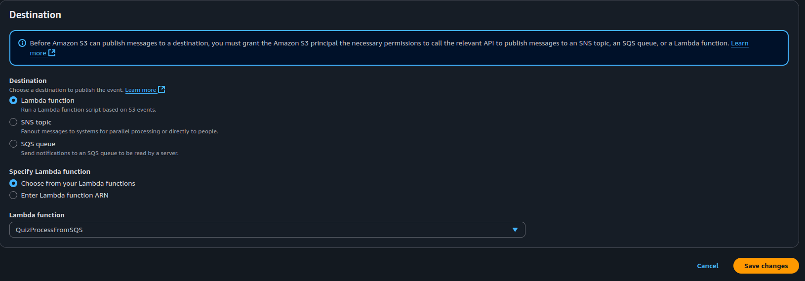

**Content:**
- [Overview](#overview)
- [Create SQS queue](#create-sqs-queue)
- [Allow S3 to send messages to SQS](#allow-s3-to-send-messages-to-sqs)
- [Add S3 Event Notification](#add-s3-event-notification)
- [Create Lambda function for SQS](#create-lambda-function-for-sqs)
- [Attach Lambda trigger](#attach-lambda-trigger)
- [Test the flow](#test-the-flow)

---

#### Overview

In this step, you'll implement a serverless event-driven flow:

(S3 → SQS → Lambda)

Whenever a new `.json` quiz file is uploaded to your S3 bucket, it triggers an SQS message. That message then invokes a Lambda function to process the uploaded file.

---

#### Definitions

- **Amazon S3 (Simple Storage Service)**: Object storage service for storing any amount of data. It supports event notifications when new objects are created.

- **Amazon SQS (Simple Queue Service)**: A fully managed message queuing service that enables you to decouple and scale microservices.

- **Lambda Trigger**: An AWS mechanism that invokes your function in response to events (e.g., from SQS or S3).

- **S3 Event Notification**: A feature that lets S3 notify other services like Lambda, SNS, or SQS when certain events (e.g., file upload) occur in a bucket.

---

#### Create SQS queue

1. Go to the **Amazon SQS** console.
2. Click **Create queue**.
3. Choose **Standard Queue** — allows high throughput and at-least-once delivery.
4. Name the queue: (QuizUploadQueue).
5. Leave default settings and click **Create Queue**.

---

#### Allow S3 to send messages to SQS

To let S3 send messages to your queue, attach a queue access policy.

1. Open (QuizUploadQueue).
2. Go to **Access policy** → click **Edit**.
3. Replace the policy with:

```json
{
  
  "Version": "2012-10-17",
  "Statement": [
    {
      "Sid": "Statement1",
      "Effect": "Allow",
      "Principal": "*",
      "Action": [
        "sqs:SendMessage"
      ],
      "Resource": "arn:aws:sqs:ap-southeast-1:466992855491:myprojectqueue" //Replace this with your SQS queue ARN
    }
  ]
}

```


> This policy allows S3 to push messages only from your specific bucket.

---

#### Add S3 Event Notification

Configure S3 to send a message to the SQS queue whenever a `.json` file is created.

1. Go to **S3** → (your-SQS-queue).
2. Select the **Properties** tab.
3. Scroll to **Event notifications** → Click **Create event notification**.
4. Configure the following:




5. Save the configuration.

> 🔎 This creates a direct connection from S3 to SQS, only for `.json` files uploaded to this bucket.

---

#### Create IAM Policy and Role for Lambda

- Before creating the Lambda function, you need to give it permission to:

    - Read files from the S3 bucket

    - Receive messages from the SQS queue

    - Write logs to CloudWatch

 1. Create IAM Policy

    Go to the IAM Console → Policies → Create policy

    Choose JSON and paste the following permissions:

    ```json
    {
    "Version": "2012-10-17",
    "Statement": [
        {
            "Sid": "VisualEditor0",
            "Effect": "Allow",
            "Action": [
                "sqs:DeleteMessage",
                "sqs:SendMessage",
                "sqs:GetQueueAttributes"
            ],
            "Resource": "arn:aws:sqs:ap-southeast-1:466992855491:myprojectqueue"
        }
    ]
    }
    ```
2. Click Next, give it a name like: QuizLambdaSQSAccessPolicy

3. Click Create policy

---

#### Create IAM Role for Lambda

   1. Go to IAM Console → Roles → Create role

   2. Trusted entity: Select (Lambda)

   3. Permissions: Attach the policy you just created

   

   4. Name the role: QuizLambdaExecutionRole

   5. Click Create role


---
#### Create Lambda function for SQS

Create a Lambda function to process files triggered by SQS messages.

1. Go to **AWS Lambda** → Create function.
2. Name: (QuizProcessFromSQS)
3. Runtime: (Node.js 20.x or 22.x)
4. Permissions: Attach the new Role you just created

Paste the following code and deploy:

```js
import { S3Client, GetObjectCommand } from "@aws-sdk/client-s3";
const s3 = new S3Client({});
const BUCKET = "myprojectbucket1290";

export const handler = async (event) => {
  console.log("SQS Event:", JSON.stringify(event));

  for (const record of event.Records) {
    const body = JSON.parse(record.body);
    const s3Info = body.Records?.[0]?.s3;

    if (!s3Info) continue;

    const key = decodeURIComponent(s3Info.object.key.replace(/\+/g, " "));
    console.log("New File Uploaded:", key);

    const res = await s3.send(new GetObjectCommand({ Bucket: BUCKET, Key: key }));
    const data = await res.Body.transformToString();
    console.log("File content:", data);
  }

  return { statusCode: 200 };
};

```

---

#### Attach Lambda trigger

1. Go to **SQS → QuizUploadQueue**.
2. Select **Lambda triggers** tab.
3. Add: (QuizProcessFromSQS) as the consumer function.


This means whenever SQS gets a new message, it will automatically trigger this Lambda.

---

#### Test the flow

1. Upload a new file to S3 (e.g., (quiz-new.json)) via the console.
2. Observe these expected results:

| ✅ Checkpoint              | Description                           |
|---------------------------|----------------------------------------|
| SQS receives message      | Message from S3 triggered              |
| Lambda is triggered       | Logs in CloudWatch confirm it ran     |
| File name is logged       | S3 key is printed to the logs         |
| File content is printed   | Lambda reads and displays file text   |