**Content:**
- Introduction
- Architecture Overview
- Step-by-Step Implementation
  - Create SNS Topic
  - Create SQS Queues
  - Subscribe SQS to SNS
  - Create Lambda Consumer
  - Create Lambda to Publish to SNS
  - Create API Gateway Endpoint
- Expected Behavior

---

**Goal**  
Allow your users or frontend clients to send quiz-related events (such as creating a new quiz) by calling an HTTP endpoint. This request goes through **API Gateway**, is processed by a **Lambda function**, published to **SNS**, and distributed (fan-out) to one or more **SQS queues**. Each queue then triggers its own **Lambda consumer** to process the message independently.

---

#### Architecture Overview

Pattern: (API Gateway → Lambda → SNS → SQS → Lambda)

**Involved Services:**

- **API Gateway** – Receives external HTTP requests
- **Lambda (Submit)** – Publishes messages to SNS
- **SNS Topic** – Broadcasts the message to SQS queues
- **SQS Queues** – Store events for consumers
- **Lambda (Consumer)** – Reads from SQS and handles processing

---

### Why This Step?

This step introduces **asynchronous event-based processing** into your architecture. It allows you to:

- Decouple frontend/API clients from backend logic
- Process events in parallel across multiple consumers
- Add new consumers in the future without changing the API
- Improve fault-tolerance and scalability

Instead of sending data directly to S3 or a Lambda, clients simply call your API Gateway. Everything behind the scenes is handled via events.

---

###  Step-by-Step Implementation

---

###  1. Create SNS Topic

1. Go to SNS → Topics → Create topic
2. Select Standard
3. Name it (QuizEventTopic)
4. Click Create topic
5. Copy the Topic ARN for later use

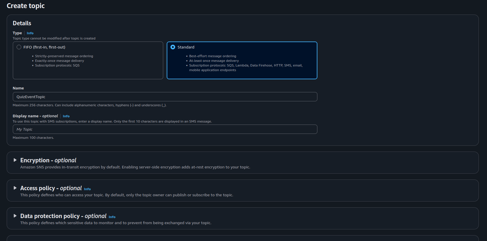

---

###  2. Subscribe SQS to SNS

1. Go to SNS → QuizEventTopic → Create subscription
2. Protocol: Amazon SQS
3. Endpoint: Paste SQS Queue ARN 

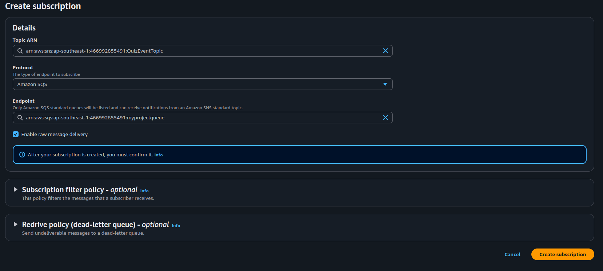

4. Confirm the subscription

---

###  3. Create Lambda Consumer (SQS → Lambda)

1. Go to AWS Lambda → Create function
2. Name: ProcessQuizEvent
3. Runtime: Node.js or Go
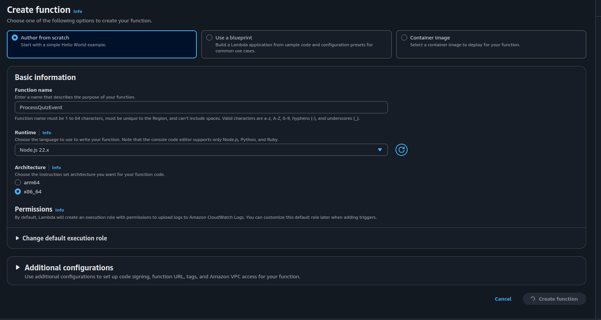
4. Go to Function Permission -> Edit -> Add created role that contain:
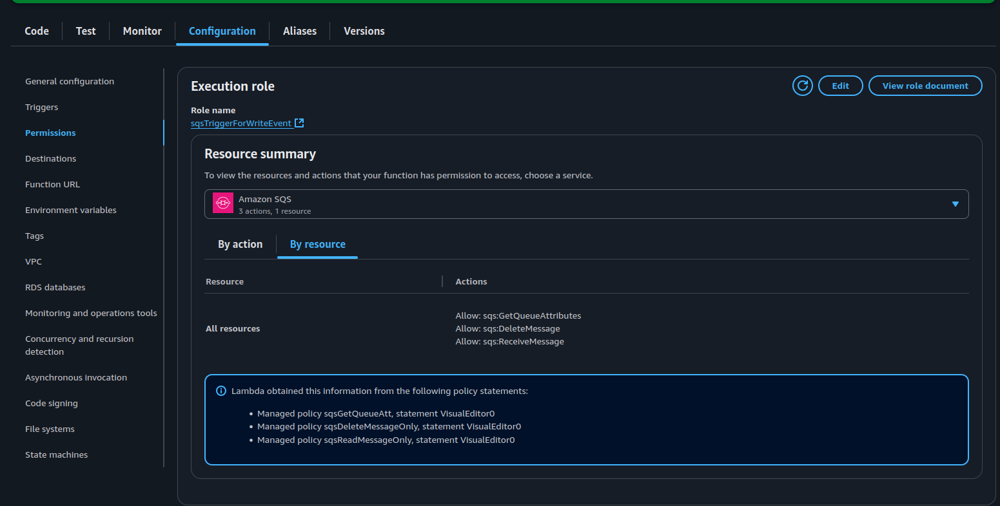
5. Add Trigger: SQS → QuizProcessingQueue
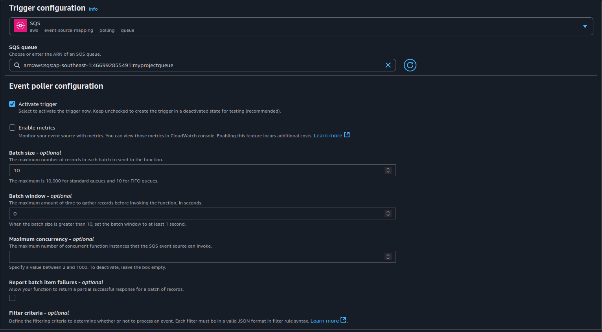
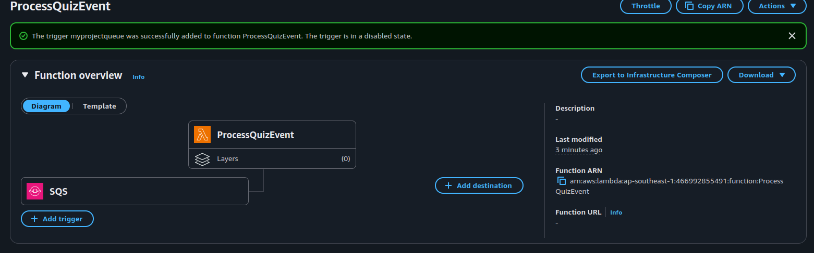

Paste this sample handler in the code section:

`````js
export const handler = async (event) => {
  console.log("SQS Event Received:", JSON.stringify(event));
  return { statusCode: 200 };
};

`````
6. Go to IAM -> Role and add new policy (AWSLambdaBasicExecutionRole) for logging:
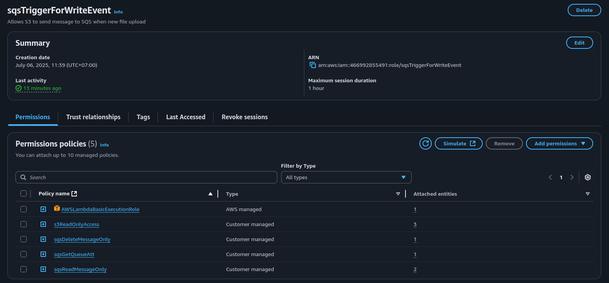

---
### 5. Create new SNS Role
 1. Go to IAM -> Policy -> Create new policy
 2. Paste this JSON as follow:
 
 ```json
 {
    "Version": "2012-10-17",
    "Statement": [
        {
            "Sid": "VisualEditor0",
            "Effect": "Allow",
            "Action": "sns:Publish",
            "Resource": "*"
        }
    ]
}
 ```
 3. Create a new role and attach the policy you just created
 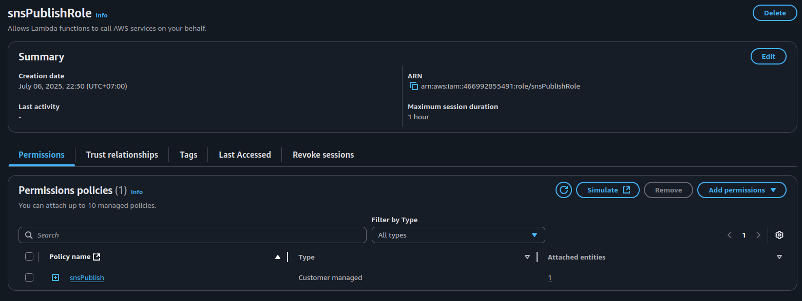

###  6. Create Lambda to Publish to SNS (API Gateway Backend)

1. Go to AWS Lambda → Create function
2. Name: SubmitQuizEvent
3. Runtime: Node.js
4. Attach the new role you just created to this function
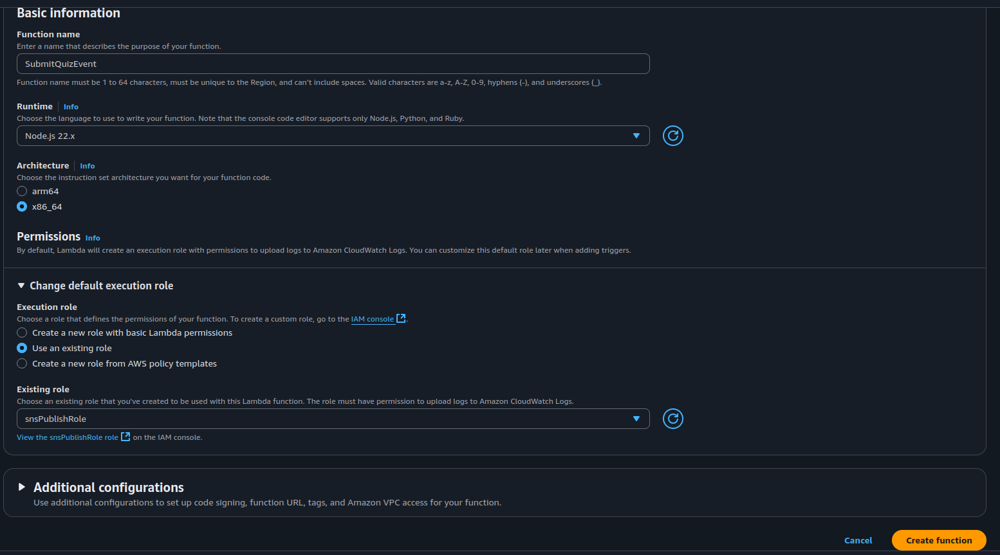

Paste this sample code:

```js

import { SNSClient, PublishCommand } from "@aws-sdk/client-sns";
const sns = new SNSClient({});

const TOPIC_ARN = "arn:aws:sns:ap-southeast-1:YOUR_ACCOUNT_ID:QuizEventTopic"; //Copy and Paste your SNS Topic ARN here

export const handler = async (event) => {
  const body = JSON.parse(event.body || "{}");

  const message = {
    default: JSON.stringify(body),
  };

  try {
    await sns.send(
      new PublishCommand({
        TopicArn: TOPIC_ARN,
        Message: JSON.stringify(message),
        MessageStructure: "json",
      })
    );

    return {
      statusCode: 200,
      body: JSON.stringify({ message: "Quiz event submitted." }),
    };
  } catch (err) {
    console.error(" Publish failed", err);
    return {
      statusCode: 500,
      body: JSON.stringify({ error: err.message }),
    };
  }
};

```
---

###  6. Create API Gateway Endpoint

1. Go to API Gateway → Create API
2. Choose: HTTP API
3. Set Integration: SubmitQuizEvent Lambda
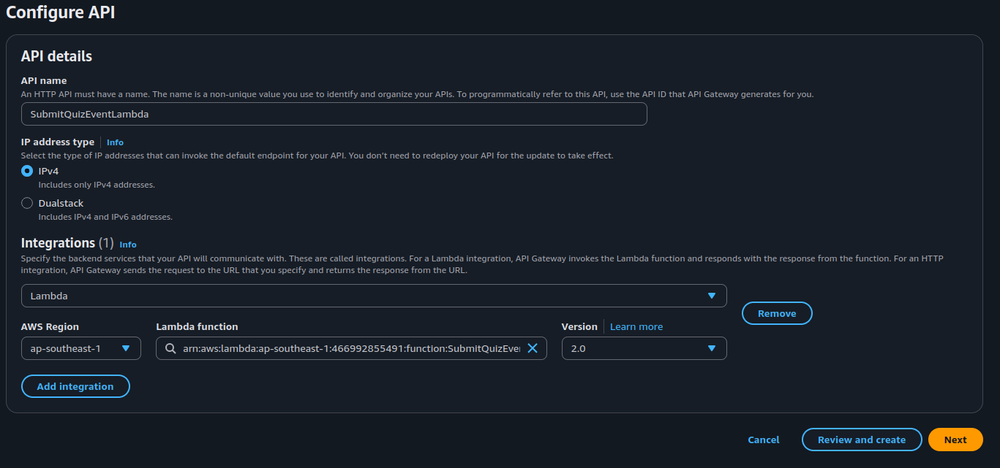
4. Create route: POST /quiz-event
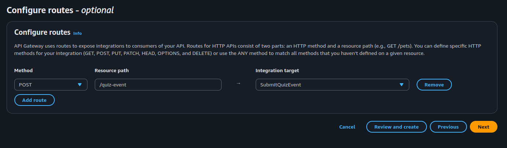
5. Deploy the API
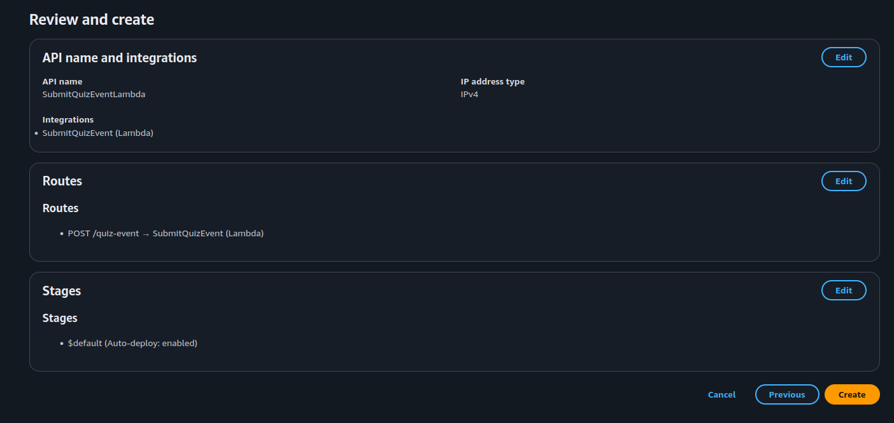
Test using (curl) or (Postman):

```bash
curl -X POST https://your-api-id.amazonaws.com/quiz-event \
  -H "Content-Type: application/json" \
  -d '{ "quiz_id": "quiz001", "event": "created" }'

```
Result:
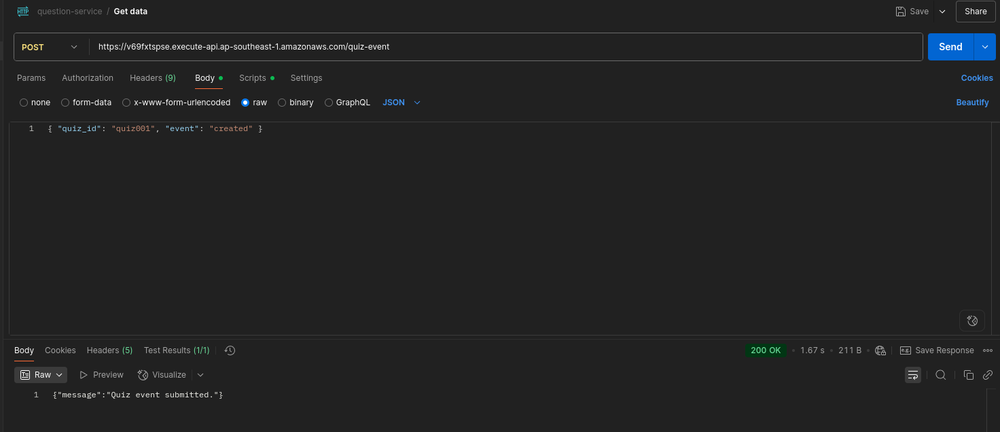

Checking using Cloud Watch:
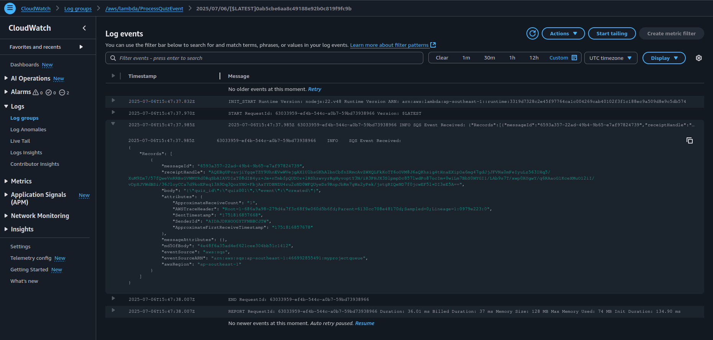
---

##  Expected Behavior

- The client sends a POST request to API Gateway
- API Gateway triggers the (SubmitQuizEvent) Lambda
- The Lambda publishes to the SNS topic
- SNS fans out the message to one or more SQS queues
- Each SQS queue triggers a Lambda consumer
- Logs confirm message flow and processing

---

