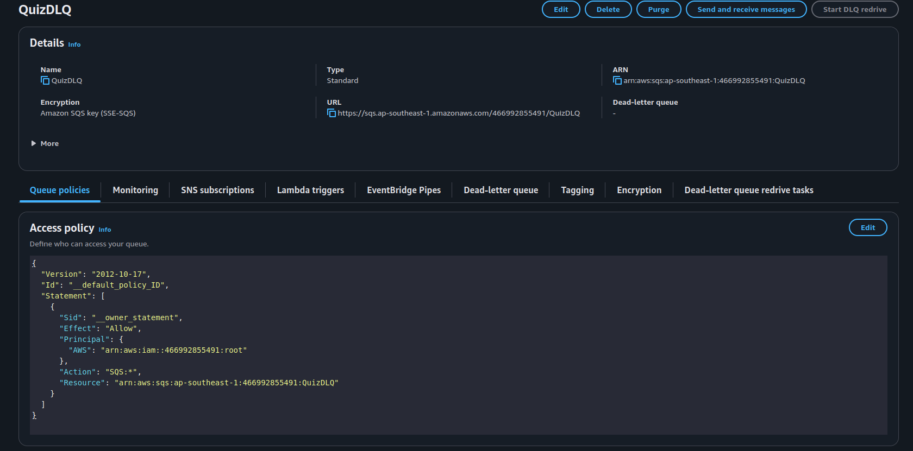
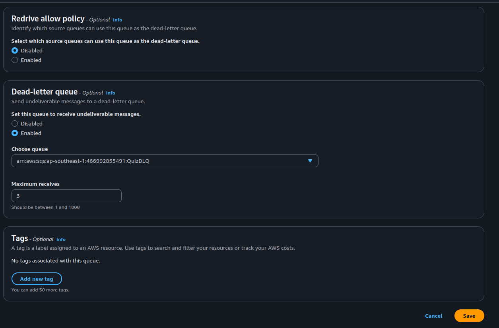
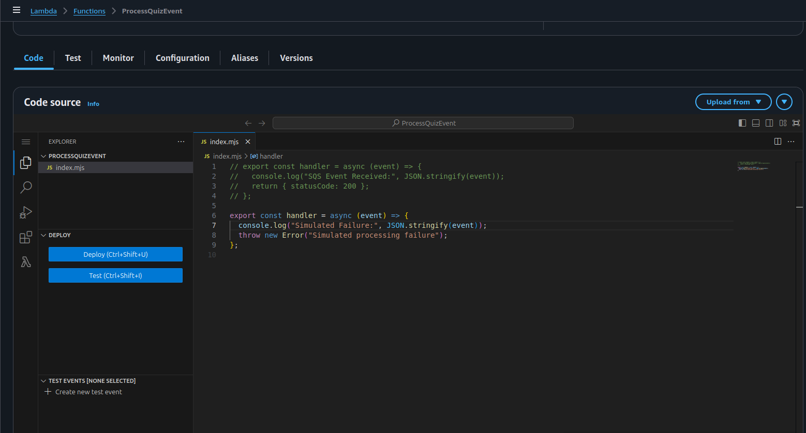
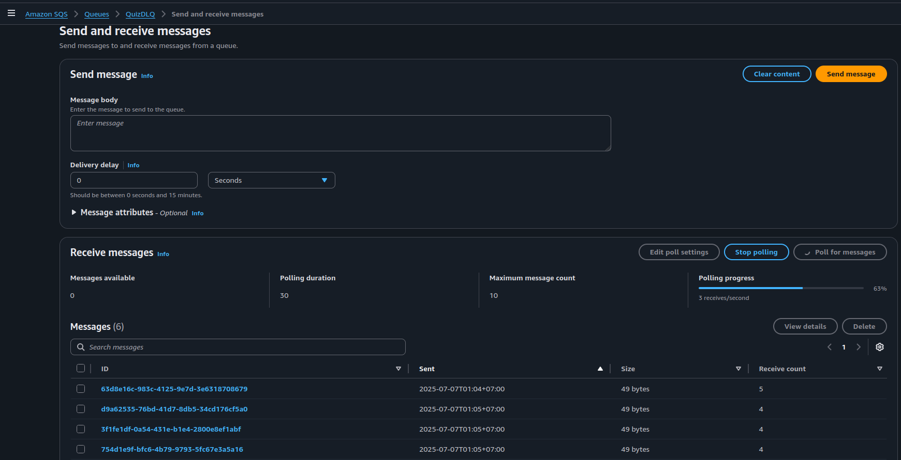

**Content:**
- Goal
- Updated Architecture
- Step-by-Step Implementation
  - Create DLQ
  - Attach DLQ to Main Queue
  - Simulate Consumer Failure
  - Send Test Message
  - Verify DLQ
- Fix and Restore
- Summary

---

###  Goal

Improve fault tolerance by capturing failed messages that cannot be processed after multiple retries — instead of silently dropping them.

### 🧱 What is a DLQ (Dead-Letter Queue)?

A **DLQ (Dead-Letter Queue)** is a separate (SQS queue) used to store messages that fail multiple times during processing. When a consumer (such as a Lambda function) tries to process a message and fails repeatedly (based on the (MaxReceiveCount) setting), that message is automatically redirected to the DLQ for later inspection.

This design prevents your main queue and processing logic from being blocked or overwhelmed by problematic messages, and provides a safety net in event-driven systems.

---

#### ✅ Why Use a DLQ?

DLQs are essential for building **resilient and fault-tolerant** architectures. They allow you to:

- **Prevent data loss**  
  Messages that can't be processed won’t be deleted or lost — instead, they're redirected to the DLQ safely.

- **Investigate message failures**  
  You can inspect failed payloads and metadata in the DLQ to find out why processing failed (e.g., malformed JSON, missing fields, downstream service errors).

- **Replay messages after fixing issues**  
  After fixing the root cause (e.g., updating code or data structure), you can manually move the message back to the main queue for reprocessing.

---

###  Step-by-Step

---

###  1. Create a DLQ (Dead-Letter Queue)

1. Go to SQS → Create queue
2. Select Type: Standard
3. Name: QuizDLQ
4. Leave other settings as default
5. Click Create queue

---

###  2. Attach DLQ to Your Main Queue

1. Open your main SQS queue 
2. Click Edit
3. Scroll to the Dead-letter queue section
4. Configure:

   - (DLQ ARN): Choose (QuizDLQ)
   - (MaxReceiveCount): Set to (3)

   *(This means after 3 failed Lambda retries, the message is sent to DLQ)*



5. Click (Save changes)

---

###  3. Simulate a Lambda Consumer Failure

Temporarily update your (ProcessQuizEvent) Lambda to fail:

Replace your handler code with this:

```js
export const handler = async (event) => {
  console.log(" Simulated Failure:", JSON.stringify(event));
  throw new Error("Simulated processing failure");
};

```

This will force every incoming message to fail.


---

###  4. Send a Test Message

Use your existing flow:

1. Send a POST request to (POST /quiz-event) via (API Gateway)
2. The message will flow through:

(API Gateway → Lambda → SNS → SQS → Lambda (fails 3 times) → DLQ)

---

###  5. Check the DLQ

1. Go to (SQS → QuizDLQ)
2. Click (Send and receive messages)
3. Click (Poll for messages)
4. Click on a message → View full details
5. You’ll see the failed event stored here



---

###  Restore the Original Lambda

Once testing is complete:

1. Revert your (ProcessQuizEvent) Lambda to its correct logic
2. Save and redeploy

Your architecture is now fault-tolerant and can safely route failing messages to a DLQ for investigation.

---

###  Summary

- (DLQ) is a backup queue for failed messages
- No data is lost — messages can be inspected or replayed
- Useful for debugging, error tracking, and retrying failed events
- Combined with retries, this is a core fault-tolerance mechanism in AWS event-driven systems

