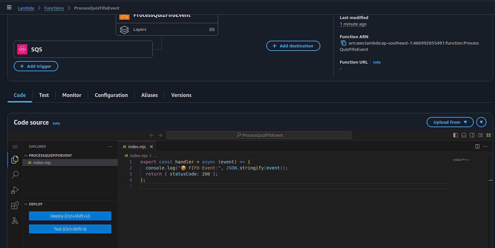

---
### Goal

Ensure that:

- Quiz events are processed in the exact order they occur (e.g., (created → updated → deleted))
- Duplicate messages are automatically prevented

---

### What is a (FIFO Queue)?

FIFO stands for First-In, First-Out

A FIFO queue guarantees:

- **Ordered Delivery**: Messages are processed in the order they were sent (within the same (MessageGroupId))
- **Exactly-Once Processing**: No duplicate messages are delivered (if your consumer is idempotent)


---

### Why Should You Use FIFO Queues?

In distributed systems, events may arrive (out of order) or get retried. Without ordering guarantees, a later update (e.g., (quiz deletion)) may be processed before an earlier one (e.g., (quiz creation)), leading to incorrect state or data corruption.

FIFO queues solve this by:

- Maintaining strict sequence of operations
- Avoiding double-processing, especially important in financial or scoring events
- Improving data integrity, which is critical in audit logs, version history, and transactional pipelines

---

#### When to Use (FIFO Queues)

- Use FIFO queues when:
  - Processing order matters (e.g., score updates, versioned content)
  - You must avoid duplicated processing
  - You need strong consistency

---

## Step-by-Step: Implementing FIFO-Based Flow

### 1. Create a (FIFO Queue)

- Go to (Amazon SQS) → (Create queue)
- Choose (FIFO queue)
- Name it: (QuizFifoQueue.fifo)
- Enable:
  - (Content-based deduplication) — or specify your own (MessageDeduplicationId)
- Click (Create)

---

### 2. Subscribe (FIFO Queue) to an Event Source

 Because SNS Standard does **not** support direct delivery to FIFO queues.

- So we modify your Lambda (SubmitQuizEvent) to send directly to the FIFO SQS queue instead of SNS.
---

### 3. Update the (Publisher Lambda) to Send to (FIFO SQS)

Modify your (SubmitQuizEvent) Lambda function:

```js
import {
  SQSClient,
  SendMessageCommand
} from "@aws-sdk/client-sqs";

const sqs = new SQSClient({});
const QUEUE_URL = "https://sqs.ap-southeast-1.amazonaws.com/YOUR_ID/QuizFifoQueue.fifo";

export const handler = async (event) => {
  const body = JSON.parse(event.body || "{}");

  const params = {
    QueueUrl: QUEUE_URL,
    MessageBody: JSON.stringify(body),
    MessageGroupId: "quiz-events", // Required
    // Optional: MessageDeduplicationId
    // MessageDeduplicationId: body.id || Date.now().toString(),
  };

  try {
    await sqs.send(new SendMessageCommand(params));
    return {
      statusCode: 200,
      body: JSON.stringify({ message: "Event sent to FIFO queue." }),
    };
  } catch (err) {
    console.error("Send failed", err);
    return {
      statusCode: 500,
      body: JSON.stringify({ error: err.message }),
    };
  }
};
```


 4. Create the Consumer Lambda

    Go to AWS Lambda → Create function

    Name it: ProcessQuizFifoEvent

    

    Attach role with sqs access

    

    Runtime: Node.js 20.x or Node.js 22.x

    Trigger: QuizFifoQueue.fifo

    

Paste the code below:

```js
export const handler = async (event) => {
  console.log(" FIFO Event:", JSON.stringify(event));
  return { statusCode: 200 };
};
```




#### Expected Behavior

- You send a (POST /quiz-event) via (API Gateway)
- The (SubmitQuizEvent) Lambda sends the payload to (QuizFifoQueue.fifo)
- (FIFO) ensures (message ordering) and (deduplication)
- The (ProcessQuizFifoEvent) Lambda processes events (in order)

---

