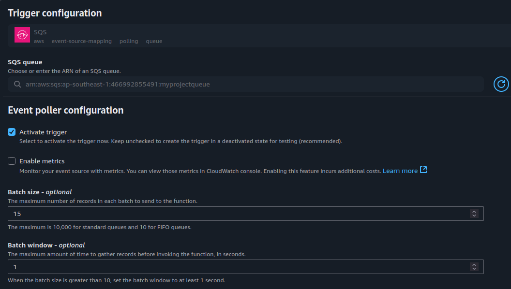
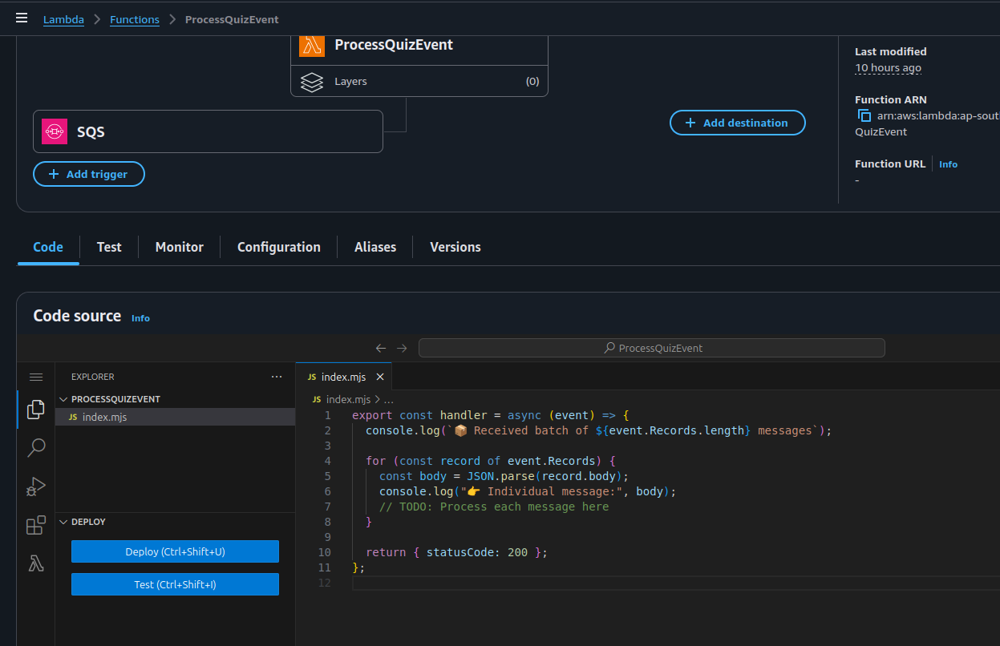
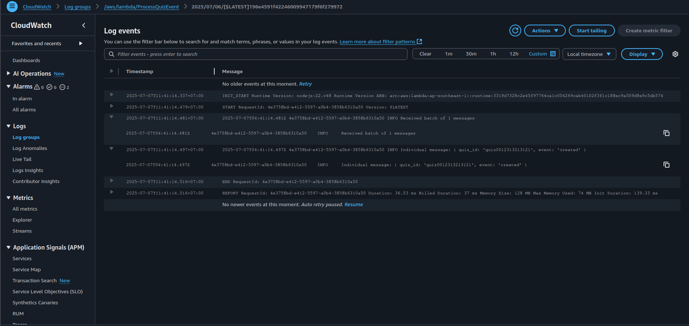

## Overview

This section outlines the recommended best practices for implementing **batch message processing** using **AWS Lambda** with **Amazon SQS**. This design pattern is a key component in scalable, cost-effective, and resilient event-driven architectures.

---

##  What is Batch Processing?

**Batch processing** refers to the execution of a group of tasks or messages together within a single unit of work.  
In AWS, this means one Lambda function invocation handles multiple SQS messages at once rather than processing them individually.

This approach enhances performance and reduces the number of invocations, which in turn reduces cost and latency.

---

##  Architectural Rationale

Batch processing is a **recommended practice** in serverless environments for the following reasons:

- **Operational Efficiency**  
  Minimizes Lambda invocations by consolidating multiple messages into a single execution cycle.

- **Throughput Optimization**  
  Reduces idle time and cold start frequency, enabling faster overall processing and lower latency under burst loads.

- **Cost Optimization**  
  Reduces the number of billable Lambda invocations, directly impacting overall execution costs.

- **Scalability and Resilience**  
  Handles high-frequency workloads gracefully. In conjunction with features like **partial batch response** and **DLQs**, batch processing enhances fault isolation and retry reliability.

- **Design Flexibility**  
  Provides better control over message ordering, timeouts, and concurrency management using FIFO queues and batch windowing.

---

##  Implementation Guide

###  1. Configure Lambda Trigger from SQS

- Navigate to **AWS Lambda** > your target function.
- Under the **Triggers** section, locate and edit the SQS trigger.
- Modify the following parameters:

  - **Batch size**  
    - Up to `10` for FIFO queues  
    - Up to `10,000` for Standard queues  
  - **Batch window** (optional)  
    - Duration (0–300 seconds): Lambda waits to buffer more messages before invoking.



---

###  2. Update Lambda Handler to Process Batches

The Lambda function must loop over `event.Records` to process each message individually within the batch:

```js
export const handler = async (event) => {
  console.log(` Received batch of ${event.Records.length} messages`);

  for (const record of event.Records) {
    const body = JSON.parse(record.body);
    console.log(" Processing message:", body);

    // Business logic here
  }

  return { statusCode: 200 };
};
```

---

###  3. Test the Batch Setup

- Send multiple messages to the SQS queue in quick succession.
- Confirm batch aggregation by reviewing **CloudWatch Logs**.

**Expected Output**:

---

###  Failure Simulation and DLQ Integration

To test failure handling:

- Force an error in one message’s processing loop.
- Observe that the entire batch is retried by default.

**Note**: Enable **Partial Batch Response** to allow successful messages to complete while failing messages are retried.

Configure a **Dead Letter Queue (DLQ)** for the SQS queue to capture failed messages after maxReceiveCount is reached.

---

##  Monitoring and Observability

Use the following **CloudWatch Metrics** for insight and alerting:

- `ApproximateNumberOfMessagesNotVisible` → Messages currently being processed  
- `NumberOfMessagesDeleted` → Successfully processed and removed from the queue  
- `NumberOfMessagesReceived` → Incoming workload  
- `IteratorAge` → Delay between message enqueue and processing

Enable structured logging and consider using **AWS X-Ray** for tracing.

---

##  Summary

Batch processing in Lambda provides a scalable and cost-efficient way to process high-throughput SQS workloads. With proper tuning and observability, it becomes a foundational pattern in resilient, event-driven cloud architectures.
