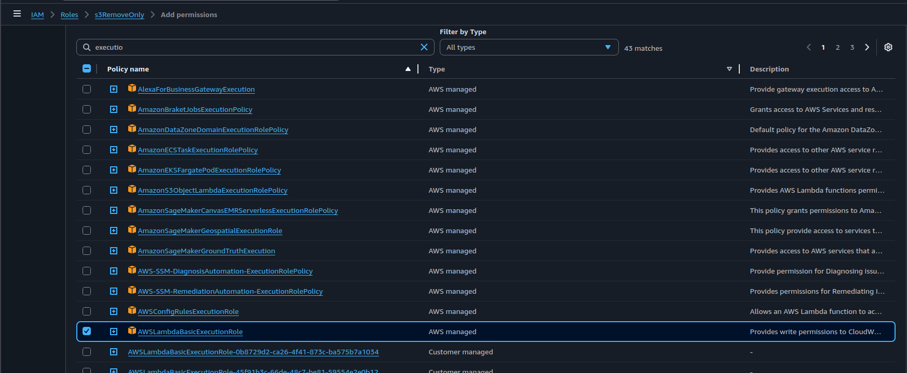
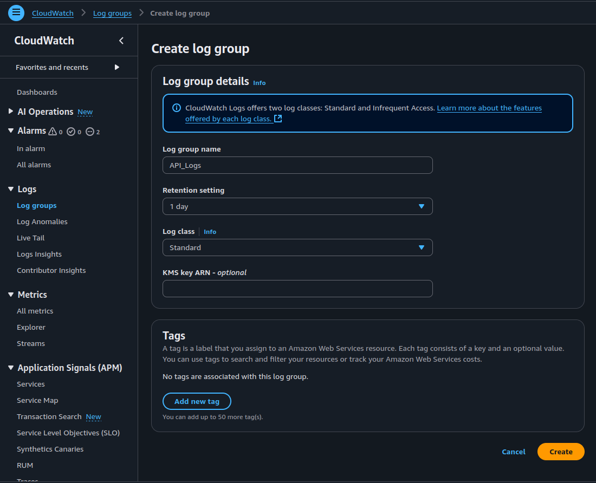
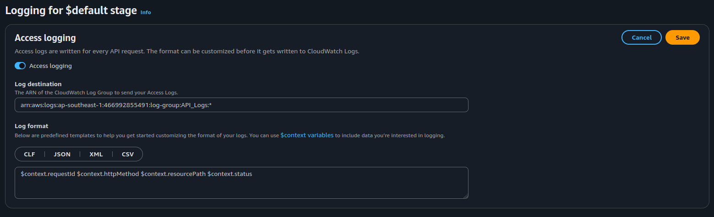
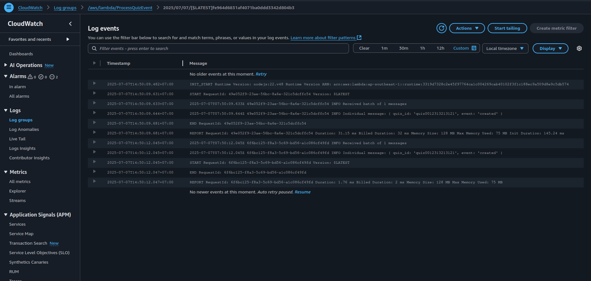

## What is Amazon CloudWatch?

Amazon CloudWatch is a fully managed observability service that provides data and actionable insights for AWS resources, applications, and services. It enables you to:

- Collect logs and metrics from AWS services and custom applications  
- Create alarms based on thresholds or anomaly detection  
- Visualize data with dashboards  
- Respond automatically to changes using events and rules

CloudWatch plays a central role in diagnosing operational issues and optimizing performance in a distributed, event-driven, or serverless architecture.

---

## Why Use Logging and CloudWatch?

Establishing proper logging and observability with CloudWatch is essential for the following reasons:

1. **Troubleshooting and Debugging:**  
   Logs help you trace issues down to the exact function or event, allowing you to resolve errors faster.

2. **Operational Monitoring:**  
   Metrics allow you to track system health — including function invocation rates, latency, and error frequency.

3. **Failure Detection:**  
   Alarms notify you proactively of problems like message backlog in queues, throttling, or DLQ overflow.

4. **Audit and Compliance:**  
   Logs serve as a historical record of system behavior for audit trails and post-incident reviews.

5. **Performance Optimization:**  
   CloudWatch metrics can be used to analyze bottlenecks, optimize compute/memory usage, and reduce cost.

---


## Objective

Implement centralized monitoring and observability for your serverless application using Amazon CloudWatch. This includes:

- Capturing logs from Lambda, API Gateway, SQS, and SNS  
- Gathering operational metrics such as invocations, errors, and latency  
- Setting up alarms to detect anomalies or failures  
- Creating dashboards to visualize system performance and health

---

## Architecture Components Under Observation

The following AWS components should be integrated with CloudWatch:

| Component        | Metrics and Logs to Monitor                          |
|------------------|-------------------------------------------------------|
| AWS Lambda       | Invocations, duration, errors, throttles             |
| Amazon SQS       | Messages sent, visible messages, DLQ queue length    |
| Amazon SNS       | Message publish success/failure                      |
| Amazon API Gateway | Request count, 4xx/5xx errors, latency            |
| Amazon S3        | Optional: access logs, request metrics               |

---

## Implementation Steps

### 1. Enable Logging for Lambda Functions

Lambda automatically integrates with CloudWatch Logs if the execution role includes the appropriate permissions.

#### Required IAM Policy

Ensure your Lambda function’s IAM role includes the following permissions:

```json
{
  "Effect": "Allow",
  "Action": [
    "logs:CreateLogGroup",
    "logs:CreateLogStream",
    "logs:PutLogEvents"
  ],
  "Resource": "*"
}
```

**Verification:**

- Navigate to the Lambda function  
- Go to Configuration → Permissions
- Confirm the IAM role includes AWSLambdaBasicExecutionRole or equivalent
- If not:
  - Go to IAM -> Role -> Choose the role used in Lambda
  - Add permissions -> Attach policies
  - Choose AWSLambdaBasicExecutionRole then Add permission
  
---

### 2. Create a New Log Group in CloudWatch

1. Navigate to Amazon CloudWatch via the AWS Management Console.

2. In the left-hand menu, select (Logs) → Log groups, then click Create log group.

3. Enter a name for the log group, set the retention policy to 1 day, and choose the Log class as Standard.



4. Click Create, then copy the Amazon Resource Name — ARN of the new log group.

---

### 2. Enable Logging in API Gateway

For HTTP APIs:

1. Open API Gateway in the AWS Management Console  
2. Select your API and then the desired Stage  
3. On the left sidebar, choose Monitor -> Logging:
   - Enable Access Logging
   - Set Log Level to INFO or ERROR
   - Specify a CloudWatch Log Group (create one if necessary)

#### Recommended Log Format

```json
$context.requestId $context.httpMethod $context.resourcePath $context.status
```


---

### 3. View and Analyze Logs in CloudWatch

- Navigate to CloudWatch → Log groups
- Locate the log group corresponding to your Lambda or API Gateway (e.g., (/aws/lambda/my-function))  
- Open logs to inspect request/response flow, exceptions, or debug outputs



#### Optional: Use CloudWatch Logs Insights

CloudWatch Logs Insights provides a query interface to search logs. Example query:

```bash
fields @timestamp, @message  
| filter @message like /error/  
| sort @timestamp desc  
```

---

### 4. Configure Alarms for Critical Metrics

Set up alarms in (CloudWatch → Alarms) to detect operational issues such as:

| Metric                      | Description                                 |
|----------------------------|---------------------------------------------|
| Lambda (Errors)            | Triggers when function errors > 0           |
| DLQ message count          | Detects if messages accumulate in DLQ       |
| API Gateway (5xx errors)   | Identifies upstream/internal service issues |
| SQS message backlog        | Use (ApproximateNumberOfMessagesVisible)    |

Alarms should be tied to actionable alerts (e.g., via SNS topic or email).

---

### 5. Build a Centralized CloudWatch Dashboard

Create a custom dashboard in (CloudWatch → Dashboards) with the following widgets:

| Widget Title               | Metrics Displayed                            |
|---------------------------|----------------------------------------------|
| Lambda Performance         | Invocations, Errors, Duration                |
| API Gateway Error Rates    | 4xx and 5xx error counts and latency         |
| SQS Queue Depth            | Message count in queues                      |
| DLQ Monitoring             | DLQ queue size over time                     |

Use these visualizations for a real-time overview of system health and performance.

---

## Expected Results

After implementing the above:

- All application components continuously stream logs to CloudWatch  
- Alarms detect and alert on system errors and delays  
- Dashboards enable real-time insights into performance and reliability  
- Logs and metrics allow for efficient debugging, root cause analysis, and operations monitoring  
